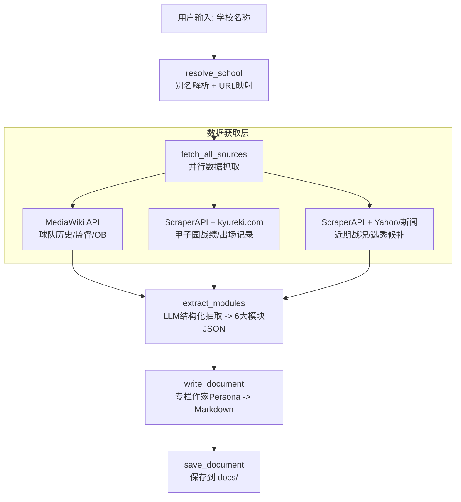

# 高校野球強校巡礼文档生成 Agent 实现计划

## 项目定位

完全从零开始实现 `Koshien School Agent`，以 `src/koshien/` 为核心新建完整链路，不依赖旧的 `src/agent/` 与 `src/sports/` 代码实现。  
首要目标是**事实保真**（evidence-first），在任何场景下都优先保证信息可追溯、可验证，其次才是文风表现。

## 整体架构




## 新增文件清单

```
src/koshien/
  __init__.py
  state.py             # KoshienState dataclass
  models.py            # 6大模块 Pydantic schema
  prompts.py           # EXTRACTION_PROMPT + WRITER_PROMPT
  nodes.py             # 5个pipeline节点
  graph.py             # LangGraph 线性流水线
  tools/
    __init__.py
    wikipedia.py       # MediaWiki API 封装
    scraper.py         # ScraperAPI 通用封装
    html_cleaner.py    # HTML -> clean Markdown
  school_registry.py   # 学校别名映射表 (dict/JSON)

run_koshien.py           # CLI入口: --school "大阪桐蔭"
```

## 依赖与配置基线

- 采用从零创建的 `src/config.py`，在 `Settings` 中定义本 Agent 所需配置（`scraper_api_key`、`koshien_max_scraper_calls` 等）
- 使用 `httpx` + `beautifulsoup4` + `langgraph` + `pydantic` + `langchain-google-genai`
- 新增依赖 `html2text` 用于 HTML -> Markdown 清洗

---

## Phase 1: 基础设施与数据获取层

**目标**: 搭建数据抓取工具链，确保能从3类数据源稳定获取原始内容。

### 1.1 扩展项目配置

从零创建 `src/config.py`，在 `Settings` 中至少包含:

```python
scraper_api_key: str = ""  # ScraperAPI key
```

在 `pyproject.toml` 新增依赖: `html2text`（直接用 httpx 调 MediaWiki Action API，不引入 mwclient）

### 1.2 学校别名映射表 (`src/koshien/school_registry.py`)

核心数据结构:

```python
@dataclass
class SchoolEntry:
    full_name: str           # "大阪桐蔭高等学校"
    short_names: list[str]   # ["大阪桐蔭", "桐蔭"]
    prefecture: str          # "大阪府"
    wiki_title: str          # "大阪桐蔭中学校・高等学校"
    kyureki_id: str          # kyureki.com 的学校ID
```

初期手动维护 20-30 所知名强校的映射，提供 `resolve(user_input: str) -> SchoolEntry | None` 函数。未命中时可降级为 LLM 辅助推断或直接用输入名做搜索。

### 1.3 MediaWiki API 工具 (`src/koshien/tools/wikipedia.py`)

- 调用 `https://ja.wikipedia.org/w/api.php?action=parse&page={title}&prop=text|sections&format=json`
- 免费、无反爬限制、返回结构化 JSON
- 按 section 提取: 球队历史、监督列表、OB 名单、部训等
- 输出: 清洗后的 Markdown 文本（`prop=text` 返回 HTML，再交给 `html2text` 转换）

### 1.4 ScraperAPI 通用封装 (`src/koshien/tools/scraper.py`)

- 封装 ScraperAPI 的代理请求: `https://api.scraperapi.com?api_key={key}&url={target_url}&country_code=jp&render={js}`
- 提供两种模式:
  - `render=false` - 用于静态页面（kyureki.com），成本低
  - `render=true` - 用于动态页面（Yahoo Japan 新闻），成本高
- 内置重试(3次) + 超时(15s) + 错误处理

### 1.5 HTML 清洗中间件 (`src/koshien/tools/html_cleaner.py`)

- 使用 BeautifulSoup 剥离广告、侧边栏、script/style
- 使用 html2text 转为 Markdown
- 保留表格结构 (`<table>` -> Markdown table)
- 截断上限: 单页 6000 字符（控制 Token 消耗）

### 1.6 针对 kyureki.com 的抓取逻辑

- URL 模式: `https://www.kyureki.com/koko/{school_id}/`
- 主要抓取页面: 历代战绩表、OB进路表
- 使用 BeautifulSoup 定位 `<table>` 标签，解析甲子园出场/优胜数据
- 输出: 结构化文本（含表格）

---

## Phase 2: Agent 核心逻辑

**目标**: 定义数据模型、编写抽取/撰写 Prompt、组装 LangGraph 流水线。

### 2.1 Pydantic 数据模型 (`src/koshien/models.py`)

对应六大信息模块:

```python
class BasicProfile(BaseModel):
    full_name: str                    # 学校全称
    short_name: str                   # 常用简称
    prefecture: str                   # 所在都道府県
    city: str                         # 市町村
    founded_year: int | None          # 学校创办年份
    baseball_club_year: int | None    # 野球部创立年份
    motto: str | None                 # 部训/口号

class KoshienRecord(BaseModel):
    spring_appearances: int | None
    spring_wins: list[str]            # 优胜年份列表
    spring_runners_up: list[str]
    summer_appearances: int | None
    summer_wins: list[str]
    summer_runners_up: list[str]
    other_titles: list[str]           # 明治神宫大会等
    special_achievements: list[str]   # 春夏連覇等

class ManagerInfo(BaseModel):
    current_manager: str | None
    current_tenure: str | None
    philosophy: str | None
    play_style_tags: list[str]        # ["超高校級打線", "機動破壊"]
    notable_past_managers: list[dict]  # [{name, tenure, legacy}]

class CultureAndRivals(BaseModel):
    famous_cheer_songs: list[str]     # 魔曲名
    cheer_description: str | None
    region_difficulty: str | None     # 激戦区描述
    rivals: list[dict]               # [{name, context}]

class FamousAlumni(BaseModel):
    active_pros: list[dict]          # [{name, team, league, position}]
    retired_legends: list[dict]      # [{name, era, achievement}]
    other_notable: list[dict]        # 非职棒界OB

class CurrentFocus(BaseModel):
    last_koshien: str | None          # 最近一次甲子園出場
    last_result: str | None
    draft_prospects: list[dict]      # [{name, year, position, note}]

class SchoolReport(BaseModel):
    """完整的强校巡礼报告"""
    profile: BasicProfile
    records: KoshienRecord
    manager: ManagerInfo
    culture: CultureAndRivals
    alumni: FamousAlumni
    current: CurrentFocus
    generated_at: str
    sources_used: list[str]
```

所有允许缺失的字段必须显式提供默认值（`=None` 或 `Field(default_factory=list)`），保证即使某些数据源失败或 LLM 漏字段也能生成部分报告。

### 2.2 KoshienState (`src/koshien/state.py`)

```python
@dataclass(kw_only=True)
class KoshienState:
    school_input: str                  # 用户原始输入
    school_entry: dict | None = None   # resolve 后的学校信息
    wiki_content: str = ""             # Wikipedia 原文
    kyureki_content: str = ""          # kyureki.com 原文
    news_content: str = ""             # 新闻原文
    extracted_data: dict | None = None # 结构化 JSON (SchoolReport)
    document_markdown: str = ""        # 最终 Markdown 文档
    output_path: str = ""              # 保存路径
```

### 2.3 抽取 Prompt (`EXTRACTION_PROMPT` in `src/koshien/prompts.py`)

- Temperature: 0（客观抽取）
- 使用 Gemini 的 `with_structured_output(SchoolReport)` 强制 JSON 模式
- System Prompt 要点:
  - "你是一个数据抽取专家，从提供的原始文本中精准提取信息"
  - "只提取有明确文本证据的信息，无法确认的字段设为 null"
  - "日文专有名词保留原文（人名、校名、曲名等）"
  - "不要推断或补充原文中不存在的信息"

### 2.4 撰写 Prompt (`WRITER_PROMPT` in `src/koshien/prompts.py`)

- Temperature: 0.6-0.7（保留文采）
- Persona: "资深高校野球记者，文风热血专业"
- 输出要求:
  - 中文为主，日文专有名词保留（甲子園、監督、OB等）
  - 严格遵循六大板块结构
  - 用 Markdown 表格展示历届成绩
  - 若某模块数据缺失，跳过该板块，不捏造
  - 文末附数据来源列表
  - **事实保真优先级最高**: 若文采表达与事实准确性冲突，必须牺牲文采；无法绑定证据的句子一律删除

**"去 AI 味" 硬编码策略** -- 在 WRITER_PROMPT 中显式写入以下反 AI 腔规则:

1. **禁用词黑名单**: 在 Prompt 中列出禁止使用的典型 AI 套话，包括但不限于:
  - "值得注意的是"、"总而言之"、"综上所述"、"不仅...而且..."、"众所周知"
  - "在...的大背景下"、"让我们一起..."、"接下来让我们看看"
  - 任何以"作为..."开头的段落引导句
2. **强制具体化**: "每个观点必须绑定至少一个具体的人名、年份、比分或事件。禁止出现不绑定事实的抽象评价（如'实力强劲'、'底蕴深厚'）。如果无法绑定具体事实，删掉该句。"
3. **节奏打破**: "段落长度必须参差不齐：短段(1-2句)与长段(4-6句)交替出现。禁止连续三个段落长度相近。"
4. **开头破冰**: "文章开头禁止概括性介绍。必须以一个具体的历史瞬间、比分、或人物轶事直接切入（in medias res），让读者一秒进入画面。"
5. **观点锐度**: "允许并鼓励表达主观判断和情感倾向（如'这可能是甲子园史上最令人窒息的决胜局'），但主观判断必须紧跟事实依据。"
6. **语言质感**: "用短句制造冲击力，用长句铺陈叙事。避免排比句超过两组。偶尔使用口语化表达打破书面腔。"

### 2.5 节点函数 (`src/koshien/nodes.py`)

5 个节点:

1. `**resolve_school`**: 查注册表解析学校 -> 失败则 LLM 猜测全称
2. `**fetch_all_sources`**: `asyncio.gather()` 并行抓取 Wikipedia + kyureki.com + 新闻
3. `**extract_modules`**: 将 3 份原文拼接，喂给 Gemini 提取 `SchoolReport` JSON
4. `**write_document**`: 将 JSON 喂给"专栏作家" LLM 生成 Markdown
5. `**save_document**`: 保存到 `docs/{school_name}_{date}.md`

### 2.6 LangGraph 组装 (`src/koshien/graph.py`)

```python
resolve_school -> fetch_all_sources -> extract_modules -> write_document -> save_document -> END
```

线性流水线，独立实现，不依赖旧 Agent 图实现。

### 2.7 CLI 入口 (`run_koshien.py`)

```bash
uv run python run_koshien.py --school "大阪桐蔭"
uv run python run_koshien.py --school "花巻東"
```

---

## Phase 3: 集成测试与优化

**目标**: 端到端联调、异常处理、多校测试、成本控制。

### 3.1 异常处理机制

- Wikipedia 未找到页面 -> 降级为 Tavily/Serper 搜索 "{school_name} 野球部 Wikipedia"
- ScraperAPI 超时/被封 -> 重试 3 次，仍失败则该数据源标记为空
- kyureki.com 学校 ID 未命中 -> 尝试按学校名站内搜索，仍失败则该数据源标记为空
- 抽取 LLM 返回格式错误 -> 最多重试 3 次，仍失败则输出部分数据
- 撰写节点失败 -> 返回 raw JSON dump 作为 fallback
- Yahoo 新闻抓取失败 -> 不替换为其他新闻源，直接标记 `news_content=""` 并在文末披露缺失来源

### 3.2 端到端测试

选取 5 所不同类型的学校:


| 类型   | 学校   | 测试重点               |
| ---- | ---- | ------------------ |
| 超级豪门 | 大阪桐蔭 | 数据极其丰富，测试信息密度      |
| 公立奇迹 | 金足農業 | 数据相对少，测试缺失字段处理     |
| 老牌名门 | PL学園 | 已废部，测试历史数据         |
| 近年崛起 | 仙台育英 | 测试近期战况模块           |
| 小众强校 | 明徳義塾 | 测试别名解析和 kyureki 映射 |


### 3.3 成本控制

- ScraperAPI 调用上限: 每次生成最多 5 次 API 调用（wiki 免费不计）
- LLM Token 预算: 抽取 ~4K input / 2K output; 撰写 ~3K input / 4K output
- 在 `Settings` 中添加 `koshien_max_scraper_calls: int = 5`

### 3.4 Yahoo Japan 新闻集成

- **Yahoo Japan 为默认且优先新闻源**
- 需要 ScraperAPI 的 `render=true` + `country_code=jp`（成本较高）
- 不做精确 HTML 解析，提取主文本块后直接交给 LLM 做信息抽取
- 搜索查询: `"{school_name} 野球部 {current_year}"` 限最近 3 个月

---

## 依赖变更

在 `pyproject.toml` 新增:

- `html2text>=2024.2.26` - HTML 转 Markdown

不引入 `mwclient`。MediaWiki Action API 设计扁平，`httpx.get()` 拼接 `action=parse&format=json` 即可，零额外依赖。

## 关键设计决策总结

- **完全从零开始**: 不恢复旧代码，新建 `src/config.py` + `src/koshien/`
- **输出语言**: 中文为主，保留日文专有名词（甲子園、監督、OB、魔曲名等）
- **事实保真优先**: 一切叙事表达服从证据约束，无法追溯来源的句子不输出
- **Scraper**: 使用 ScraperAPI（`api.scraperapi.com`），配置在 `.env` 的 `SCRAPER_API_KEY`
- **新闻源优先级**: Yahoo Japan > 无新闻（不自动切换到其他新闻站）
- **LLM**: Gemini（抽取用 temperature=0，撰写用 temperature=0.6）
- **所有 schema 字段可选**: 保证部分数据源失败时仍能输出
- **去 AI 味**: 撰写 Prompt 内置反 AI 腔策略（见 Phase 2.4）
- **已有 API keys 复用**: `.env` 中已有的 GOOGLE/TAVILY/JINA/SERPER keys 全部可用

---

## 任务清单版本（每步含输入/输出/验收标准）

> 执行原则：完全从零开始、事实保真优先、新闻源优先 Yahoo Japan。

### T01 - 创建项目骨架与目录

- **输入**: 当前仓库根目录、目标结构定义（`src/koshien/`、`run_koshien.py`）
- **输出**: 目录与空文件创建完成（含 `tools/` 子目录和 `__init__.py`）
- **验收标准**:
  - `src/koshien/` 结构与计划一致
  - 所有 Python 文件可被解释器导入（无路径/包初始化错误）

### T02 - 从零创建配置模块

- **输入**: `.env` 中可用 key、配置需求（`scraper_api_key`、`koshien_max_scraper_calls`）
- **输出**: `src/config.py`，含 `Settings` 与环境变量读取逻辑
- **验收标准**:
  - 未设置 `SCRAPER_API_KEY` 时有明确报错或可控默认行为
  - `koshien_max_scraper_calls` 可通过环境变量覆盖

### T03 - 增加依赖并锁定安装

- **输入**: `pyproject.toml` 当前依赖、目标新增 `html2text`
- **输出**: 依赖声明更新并可安装
- **验收标准**:
  - `html2text` 已在依赖中声明
  - 本地安装后 `import html2text` 成功

### T04 - 实现学校映射表与解析器

- **输入**: 20-30 所学校基础映射数据（全称/简称/wiki_title/kyureki_id）
- **输出**: `src/koshien/school_registry.py` + `resolve()` 解析函数
- **验收标准**:
  - 常见简称（如“大阪桐蔭”）可解析到唯一 `SchoolEntry`
  - 未命中返回 `None` 或标准化失败结果，不抛未处理异常

### T05 - 实现 Wikipedia 抓取工具

- **输入**: `wiki_title`、MediaWiki API（`prop=text|sections`）
- **输出**: `src/koshien/tools/wikipedia.py`，返回清洗前 HTML/结构化 section 数据
- **验收标准**:
  - 正常学校可返回非空正文
  - 404/页面不存在时返回可判定失败状态（非崩溃）

### T06 - 实现 ScraperAPI 封装与 HTML 清洗

- **输入**: 目标 URL、`render` 开关、超时/重试策略
- **输出**: `src/koshien/tools/scraper.py` + `src/koshien/tools/html_cleaner.py`
- **验收标准**:
  - `render=false/true` 两模式均可调用
  - 单页文本清洗后长度被限制在 6000 字符内
  - 失败重试最多 3 次并记录失败原因

### T07 - 实现 kyureki.com 抓取与表格解析

- **输入**: `kyureki_id`、学校页面 HTML
- **输出**: 可用于抽取的结构化文本（战绩/OB 相关）
- **验收标准**:
  - 至少提取到 1 份关键表格内容或明确无数据说明
  - 页面结构变化时不会导致节点崩溃（返回空数据+错误说明）

### T08 - 定义数据模型与状态模型

- **输入**: 六大模块字段定义、容错要求（可缺失）
- **输出**: `src/koshien/models.py`、`src/koshien/state.py`
- **验收标准**:
  - 可缺失字段均有默认值（`None` 或 `default_factory=list`）
  - 部分字段缺失时 `SchoolReport` 仍可通过校验

### T09 - 编写抽取与写作 Prompt

- **输入**: 原始多源文本、事实保真规则、输出格式规则
- **输出**: `src/koshien/prompts.py`（`EXTRACTION_PROMPT` + `WRITER_PROMPT`）
- **验收标准**:
  - 抽取 Prompt 明确“仅基于证据，不推断”
  - 写作 Prompt 明确“事实优先于文采，无法溯源不输出”
  - 输出要求包含来源列表

### T10 - 实现节点与图编排

- **输入**: `KoshienState`、工具函数、Prompt、LLM 配置
- **输出**: `src/koshien/nodes.py`、`src/koshien/graph.py`
- **验收标准**:
  - 流程顺序为 `resolve -> fetch -> extract -> write -> save`
  - 任一数据源失败时流程不断（降级继续）
  - 抓取调用计数不超过 `koshien_max_scraper_calls`

### T11 - 实现 CLI 入口与文档落盘

- **输入**: `--school` 参数、运行环境变量
- **输出**: `run_koshien.py`，生成 `docs/{school_name}_{date}.md`
- **验收标准**:
  - 命令可执行：`uv run python run_koshien.py --school "大阪桐蔭"`
  - 输出文件存在且包含 6 模块（有数据则写，无数据则跳过并说明）

### T12 - 集成测试（5 校）与质量门禁

- **输入**: 5 所测试学校清单、预算阈值、质量指标
- **输出**: 测试记录（成功/失败、耗时、调用次数、缺失模块）
- **验收标准**:
  - `schema_valid_rate >= 95%`（结构化抽取校验通过率）
  - `source_attribution_rate = 100%`（输出事实均可对应来源段落）
  - 单次任务 ScraperAPI 调用 `<= 5`
  - Yahoo 不可用时系统可完成输出，并显式披露新闻源缺失

