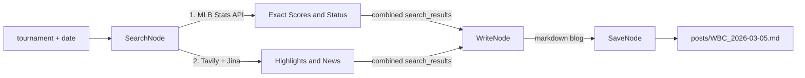

# Sports Game Blog Agent

## Architecture

A new, independent LangGraph agent alongside the existing job-analysis agent. Reuses shared config ([`src/config.py`](src/config.py) for Tavily key, Gemini LLM) but has its own state, nodes, prompts, and graph.

The `search_node` uses **hybrid retrieval** -- an official API for accurate scores, combined with web search for rich narrative content:



## New Files

| File | Purpose |

|------|---------|

| [`src/sports/__init__.py`](src/sports/__init__.py) | Package init |

| [`src/sports/state.py`](src/sports/state.py) | `SportsState` TypedDict |

| [`src/sports/prompts.py`](src/sports/prompts.py) | `BLOG_WRITER_PROMPT` with trust-weighted data source instructions |

| [`src/sports/nodes.py`](src/sports/nodes.py) | `search_node` (hybrid), `write_node`, `save_node` |

| [`src/sports/graph.py`](src/sports/graph.py) | 3-node linear `StateGraph` |

| [`run_sports.py`](run_sports.py) | Entry script with `--tournament` enum and `--date` CLI args |

## Key Implementation Details

### State (`src/sports/state.py`)

```python
class SportsState(TypedDict):
    tournament: str          # e.g. "WBC", "MLB"
    date: str                # YYYY-MM-DD
    search_results: str      # combined API data + web content
    blog_markdown: str       # final blog post
    output_path: str         # saved file path
```

### Nodes (`src/sports/nodes.py`)

#### 1. `search_node` -- Hybrid Retrieval

Three sequential steps, then combine:

**Step 1: Structured API data (Official API)**

Detect `tournament` value and route to the appropriate API:

- `"WBC"` -> `https://statsapi.mlb.com/api/v1/schedule?startDate={date}&endDate={date}&sportId=51&hydrate=team,linescore`
- `"MLB"` -> same URL but `sportId=1`
- Other tournaments -> skip API step, rely solely on web search.

Parse the JSON response to extract: matchups (team names), game status (Preview / In Progress / Final), and linescore (runs per inning, total R/H/E). Format as a clean text block labeled `## Official API Game Results`.

Use `httpx.AsyncClient` with a 10s timeout. If the API call fails, log a warning and proceed with web-only data.

**Step 2: Web search for highlights and news**

Run 2 Tavily searches:

- `"{tournament} {date} game highlights results recap"`
- `"{tournament} {date+1} schedule preview upcoming games"`

Read the top 2 URLs via Jina Reader. **Safe truncation**: hard-cap each page at `content[:3000]` characters (since the API already provides the score baseline, web content is supplementary).

**Step 3: Combine**

Concatenate into `search_results`:

```
== OFFICIAL API DATA (TRUST THIS FOR SCORES) ==
{api_formatted_text}

== WEB SEARCH HIGHLIGHTS (USE FOR NARRATIVE COLOR) ==
{web_content}
```

#### 2. `write_node` -- Blog Generation

Send `search_results` to Gemini with `BLOG_WRITER_PROMPT`. The prompt instructs the LLM to produce:

- Today's game results with final scores (from API data)
- Key highlights: home runs, dominant pitching, upsets, clutch plays (from web data)
- Brief next-day preview: upcoming matchups and start times
- Concise tone -- sports newsletter style, not a long article
- Bilingual: English section first, then Chinese section

Output stored in `blog_markdown`.

#### 3. `save_node` -- File Output

Write `blog_markdown` to `posts/{TOURNAMENT}_{YYYY-MM-DD}.md`. Create `posts/` directory if absent. Set `output_path`.

### Prompts (`src/sports/prompts.py`)

`BLOG_WRITER_PROMPT` includes explicit data-source trust weighting:

> "CORE RULE: For all scores, win/loss outcomes, and game statuses, you MUST use the 'Official API Game Results' section as the single source of truth. Do NOT override these with information from news articles."

>

> "Use the 'Web Search Highlights' section to enrich the blog with narrative details: who hit home runs, who was the winning/losing pitcher, crowd atmosphere, standout defensive plays, etc."

### Entry Script (`run_sports.py`)

```
uv run python run_sports.py                            # WBC, today
uv run python run_sports.py --tournament MLB --date 2026-03-10
```

`--tournament` accepts standard values: `WBC`, `MLB` (validated via `argparse choices`). Extensible for future tournaments. `--date` defaults to today.

## Reused Infrastructure

- [`src/config.py`](src/config.py) -- `get_settings()` for `tavily_api_key`, `google_api_key`, `llm_model_name`
- Tavily client instantiated directly in the node (not via `@tool`, since this is a simple pipeline with no tool-calling loop)
- Gemini LLM via `ChatGoogleGenerativeAI`
- MLB Stats API is free, public, and requires no API key

## File System

- Blog posts saved to `posts/` directory (added to `.gitignore`)
- Filename pattern: `posts/{TOURNAMENT}_{YYYY-MM-DD}.md`